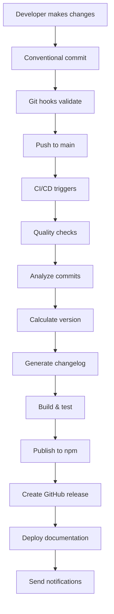

# 🎉 CI/CD Automation Implementation Complete

## ✅ What's Been Implemented

### 🚀 **Semantic Release Automation**
- Complete semantic-release configuration with all necessary plugins
- Automatic version management based on conventional commits  
- Automated changelog generation
- GitHub releases with release notes
- npm package publishing
- Git tagging and commit management

### 🛠️ **GitHub Actions Workflows**
- **CI/CD Pipeline** (`.github/workflows/ci-cd.yml`):
  - Code quality checks (ESLint, Prettier, TypeScript)
  - Comprehensive test suite with coverage
  - Example validation
  - Documentation generation  
  - Security auditing
  - Automated release process
  - GitHub Pages deployment
  - Success/failure notifications

- **Documentation** (`.github/workflows/docs.yml`):
  - Automatic documentation generation on changes
  - GitHub Pages deployment
  - Multi-format docs (Markdown, HTML, JSON)

- **Release Preview** (`.github/workflows/release-preview.yml`):
  - Shows what would be released in PR comments
  - Validates conventional commit format
  - Provides release impact analysis

### 📝 **Conventional Commits Enforcement** 
- Commitlint configuration for strict message validation
- Husky git hooks for pre-commit and commit-msg validation
- Automatic code formatting and linting before commits
- Test execution on pre-commit

### 📚 **Documentation System**
- Automated TypeDoc API documentation
- Coverage reports with visual HTML output
- Example documentation with execution validation
- Complete documentation deployment to GitHub Pages
- Interactive HTML documentation browser

### 🔧 **Developer Experience**
- Health check script for configuration validation
- Comprehensive npm scripts for all workflows
- Legacy release script with clear deprecation path
- Detailed documentation for contributors
- Clear migration guide for conventional commits

## 🎯 **Automated Release Flow**



## 📊 **Quality Gates**

Every release automatically passes through:
- ✅ **ESLint**: Code quality and style validation
- ✅ **Prettier**: Code formatting consistency  
- ✅ **TypeScript**: Type checking and compilation
- ✅ **Jest**: Unit and integration tests with coverage
- ✅ **Examples**: Validate example scripts execution
- ✅ **Documentation**: Generate and validate docs
- ✅ **Security**: npm audit for vulnerabilities
- ✅ **Build**: Successful TypeScript compilation

## 🚀 **Ready for Production**

### ✅ Completed Features
- [x] Semantic versioning automation
- [x] Conventional commit validation
- [x] Automated changelog generation
- [x] GitHub Pages documentation deployment
- [x] npm package publishing
- [x] Quality gate enforcement
- [x] Example validation
- [x] Security auditing
- [x] Success/failure notifications
- [x] Release preview in PRs
- [x] Legacy fallback scripts
- [x] Comprehensive documentation

### 🔧 Next Steps (Repository Owner)
1. **Configure GitHub Secrets**:
   ```
   NPM_TOKEN=<your-npm-token>
   GITHUB_TOKEN=<automatically-provided>
   ```

2. **Enable GitHub Pages** (if not already enabled):
   - Repository Settings → Pages
   - Source: Deploy from a branch
   - Branch: gh-pages

3. **Test the Full Pipeline**:
   ```bash
   # Make a change with conventional commit
   git commit -m "feat: add new awesome feature"
   git push origin main
   # Watch the magic happen! 🎉
   ```

4. **Monitor First Release**:
   - Check Actions tab for pipeline execution
   - Verify npm package publication
   - Confirm documentation deployment
   - Review GitHub release creation

## 💡 **Usage Examples**

### For Contributors
```bash
# Feature development
git commit -m "feat: add caching mechanism"

# Bug fixes  
git commit -m "fix: resolve memory leak in browser pool"

# Breaking changes
git commit -m "feat!: redesign configuration API

BREAKING CHANGE: Configuration schema has changed"

# Documentation
git commit -m "docs: update API examples"
```

### For Maintainers
```bash
# Preview what would be released
pnpm run release:dry

# Generate changelog manually
pnpm run changelog

# Validate CI/CD configuration
pnpm run health-check

# Emergency manual release (not recommended)
pnpm run release:legacy
```

## 📈 **Benefits Achieved**

- **🔄 Fully Automated**: Zero manual intervention needed
- **📦 Consistent Releases**: Semantic versioning ensures predictability
- **📚 Always Updated Docs**: Documentation automatically stays current
- **🛡️ Quality Assured**: Every release passes comprehensive validation
- **🚀 Fast Feedback**: Immediate CI/CD feedback on every change
- **📊 Transparent**: Complete release history and changelogs
- **🤝 Contributor Friendly**: Clear guidelines and automated validation

## 🎉 **The Crawlee Scraper Toolkit is now fully automated!**

From this point forward:
- **Developers**: Focus on features, not release mechanics
- **Maintainers**: Trust the automation, monitor the metrics
- **Users**: Enjoy consistent, well-documented releases
- **Community**: Contribute with confidence using clear guidelines

**🚀 Happy automating!** 🤖✨
