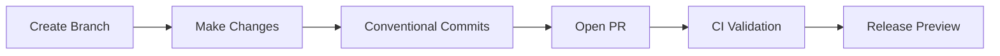
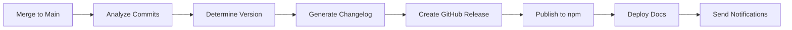

# 🚀 Release Process Documentation

This document describes the automated release process for Crawlee Scraper Toolkit.

## 📋 Overview

The project uses **semantic-release** with **conventional commits** for fully automated:
- Version management
- Changelog generation  
- GitHub releases
- npm publishing
- Documentation deployment
- Notifications

## 🔄 Automated Workflow

### 1. Development Phase


### 2. Release Phase


## 📝 Conventional Commits Reference

### Commit Types & Version Impact

| Type | Description | Version Bump | Example |
|------|-------------|--------------|---------|
| `feat` | New feature | **Minor** (1.0.0 → 1.1.0) | `feat: add caching plugin` |
| `fix` | Bug fix | **Patch** (1.0.0 → 1.0.1) | `fix: resolve memory leak` |
| `feat!` | Breaking change | **Major** (1.0.0 → 2.0.0) | `feat!: redesign API` |
| `docs` | Documentation | **None** | `docs: update README` |
| `style` | Code style | **None** | `style: fix formatting` |
| `refactor` | Code refactoring | **None** | `refactor: optimize parser` |
| `test` | Tests | **None** | `test: add unit tests` |
| `chore` | Maintenance | **None** | `chore: update deps` |
| `perf` | Performance | **None** | `perf: improve scraping speed` |
| `ci` | CI/CD changes | **None** | `ci: update workflow` |

### Scope Examples

```bash
feat(core): add browser pool management
fix(cli): resolve template generation issue
docs(api): update configuration examples
test(utils): add validator tests
```

### Breaking Changes

```bash
feat!: redesign configuration API

BREAKING CHANGE: Configuration schema has changed.
Old format is no longer supported. Ensure to check the main README or CHANGELOG for migration notes if applicable.
```

## 🛠️ Configuration Files

### `.releaserc.json`
Main semantic-release configuration with plugins for:
- Commit analysis
- Changelog generation
- npm publishing
- GitHub releases
- Git tagging

### `.commitlintrc.json`
Commit message validation rules enforcing conventional format.

### `.github/workflows/ci-cd.yml`
Complete CI/CD pipeline including:
- Code quality checks
- Test execution
- Build validation
- Example testing
- Documentation generation
- Security audit
- Automated release

## 🎯 Release Validation Pipeline

### Pre-Release Checks
1. **ESLint**: Code quality and style
2. **Prettier**: Code formatting
3. **TypeScript**: Type checking and compilation
4. **Jest**: Unit and integration tests
5. **Examples**: Validate example scripts
6. **Security**: npm audit for vulnerabilities
7. **Documentation**: Generate and validate docs

### Release Process
1. **Commit Analysis**: Parse conventional commits
2. **Version Calculation**: Determine semantic version
3. **Changelog Generation**: Create release notes
4. **Build Artifacts**: Compile TypeScript to dist/
5. **npm Publish**: Release to npm registry
6. **GitHub Release**: Create release with assets
7. **Documentation**: Deploy to GitHub Pages
8. **Notifications**: Success/failure alerts

## 📊 Release Environments

### Development (`dev` branch)
- Continuous integration
- Preview releases
- Documentation updates

### Staging (PRs to `main`)
- Release preview comments
- Full validation pipeline
- Breaking change analysis

### Production (`main` branch)
- Automatic releases
- npm publishing
- GitHub Pages deployment

## 🚨 Emergency Procedures

### Manual Release (Emergency Only)
```bash
# Preview what would be released
pnpm run release:dry

# Emergency manual release (bypasses automation)
pnpm run release:legacy
```

### Rollback Procedure
```bash
# Revert problematic commit
git revert <commit-hash>

# Force new patch release
git commit -m "fix: revert problematic changes"
git push origin main
```

### Skip CI Release
```bash
git commit -m "docs: update README [skip ci]"
```

## 📈 Monitoring & Analytics

### Release Metrics
- Build success rate
- Test coverage trends
- Release frequency
- Time to release
- Documentation freshness

### Key Performance Indicators
- **MTTR** (Mean Time To Release): < 10 minutes
- **Success Rate**: > 95%
- **Test Coverage**: > 80%
- **Documentation Coverage**: 100% of public API

## 🔧 Troubleshooting

### Common Issues

#### Release Not Triggered
- ✅ Check commit message follows conventional format
- ✅ Verify no `[skip ci]` in commit message
- ✅ Ensure push to `main` branch
- ✅ Check CI/CD workflow status

#### npm Publish Failed
- ✅ Verify npm token in GitHub secrets
- ✅ Check package.json version conflicts
- ✅ Ensure npm registry accessibility

#### Documentation Deploy Failed
- ✅ Check GitHub Pages settings
- ✅ Verify GITHUB_TOKEN permissions
- ✅ Validate documentation generation

#### Version Calculation Wrong
- ✅ Review commit history for conventional format
- ✅ Check for missing BREAKING CHANGE notes
- ✅ Validate semantic-release configuration

### Debug Commands

```bash
# Verbose release dry-run
DEBUG=semantic-release:* pnpm run release:dry

# Check commit parsing
npx conventional-commits-parser < .git/COMMIT_EDITMSG

# Validate release config
npx semantic-release --dry-run --debug
```

## 📚 Additional Resources

- [Semantic Release Documentation](https://semantic-release.gitbook.io/)
- [Conventional Commits Specification](https://www.conventionalcommits.org/)
- [GitHub Actions Documentation](https://docs.github.com/en/actions)
- [npm Publishing Guide](https://docs.npmjs.com/packages-and-modules/contributing-packages-to-the-registry)

## 🤝 Contributing to Release Process

To improve the release process:

1. **Test Changes**: Use dry-run mode extensively
2. **Monitor Metrics**: Track release success rates
3. **Update Documentation**: Keep this guide current
4. **Validate Automation**: Ensure all steps are automated
5. **Gather Feedback**: Collect team input on process improvements

---
